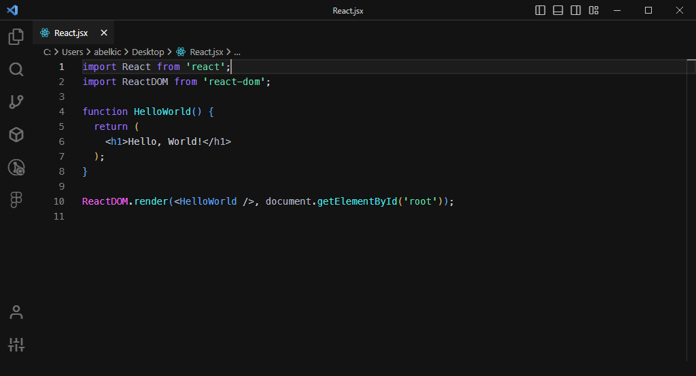

# Solware+ 🌠

A Visual Studio Code theme for the solware team developers. Fine-tuned for those of us who like to code late into the night. Color choices have taken into consideration what is accessible to people with colorblindness and in low-light circumstances. Decisions were also based on meaningful contrast for reading comprehension and for optimal razzle dazzle. ✨

About this theme, and some of the considerations made while creating it (as well as _how_ to create it should you want to make your own): [https://css-tricks.com/creating-a-vs-code-theme/](https://css-tricks.com/creating-a-vs-code-theme/)

## Solware+



# Installation

1.  Install [Visual Studio Code](https://code.visualstudio.com/)
2.  Launch Visual Studio Code
3.  Choose **Extensions** from menu
4.  Click on the three dots **…** on the top right of the sidebar
5.  Click **Install from VSIX**
6.  Select the VSIX file and install it.

## Preferences shown in the preview

The font in the preview image is Menlo, [available here](https://www.cufonfonts.com/font/menlo). Editor settings to activate font ligatures:

```
"editor.fontFamily": "Menlo, Menlo, IBM Plex Mono, Menlo, monospace",
"editor.fontLigatures": false,
"editor.fontSize": 14,
"editor.lineHeight": 1.55,
"workbench.productIconTheme": "feather-vscode",
```

## Preferences for pair colorization

In your `settings.json` pass `editor.bracketPairColorization.enabled` to `true`, then paste in the custom palette.

```
"workbench.colorCustomizations": {
	"editorBracketHighlight.foreground1": "#5caeef",
	"editorBracketHighlight.foreground2": "#dfb976",
	"editorBracketHighlight.foreground3": "#c172d9",
	"editorBracketHighlight.foreground4": "#4fb1bc",
	"editorBracketHighlight.foreground5": "#97c26c",
	"editorBracketHighlight.foreground6": "#abb2c0",
	"editorBracketHighlight.unexpectedBracket.foreground": "#db6165"
}
```

## Misc

This is my first foray into creating a theme, so if you see something wrong, please feel free to contact me on Teams, I'm sure there are things I missed.

This palette was inspired in part by "gatsby-highlight" plugin [Gatsby](https://www.gatsbyjs.com/plugins/gatsby-remark-highlight-code/).
