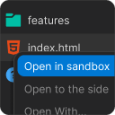

### SolwarePlus

**Description:**
Right-click a file, then click "Open in next sandbox" to open it in the next sandbox environment.

**Features:**

- **Command:** Open in next sandbox
  - Title: `Open in next sandbox`
  - Description: Opens files in a separate sandbox for isolated execution.

**Installation Requirements:**

- VSCode version: `^1.62.0`

**Usage:**
1. Download or clone the repository from [GitHub](https://github.com/asmirbelkic/solware.git).
2. Run the extension in your local environment.
3. Use the provided commands to manage files and custom styles.

### Repository Information

- **Name:** SolwarePlus
- **Author:** Asmir Belkic
- **Repository URL:** https://github.com/asmirbelkic/solware.git

For detailed development instructions or additional features, refer to the source code and documentation within the repository.